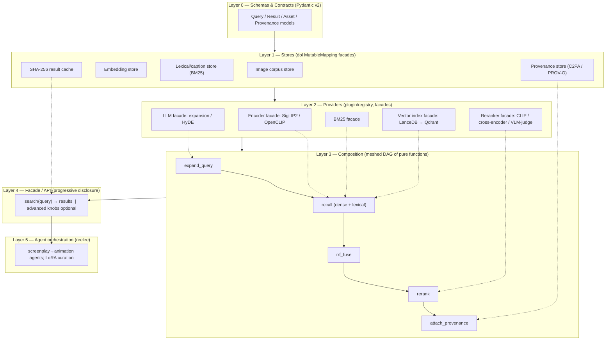

# Cross-Modal Text-to-Image Retrieval Over an Existing Image Corpus: A Technical Architecture for `reelee`

*Author: Thor Whalen*
*Date: June 17, 2026*

> A downloadable Markdown (`.md`) report. Copy the content below into `reelee-cross-modal-retrieval.md`.

## TL;DR

- **Build a two-stage hybrid pipeline**: a cheap recall stage (BM25 over captions/tags + ANN over SigLIP 2 image embeddings, fused with Reciprocal Rank Fusion) feeding an expensive precision reranker (CLIP re-scoring, and a VLM-as-judge only at the very top). For the `reelee` corpus, **SigLIP 2 (So400m, Apache-2.0) is the recommended default encoder** because it is commercially safe, open-weight, and posts the strongest open retrieval numbers in its class.
- **License discipline is the deciding factor among near-equivalent models.** SigLIP 2, OpenCLIP/LAION, MetaCLIP-1, and EVA-CLIP are commercially usable; **OpenAI CLIP, Meta CLIP 2 "worldwide" weights, Jina-CLIP v2, Nomic Embed Multimodal, and Meta's Perception Encoder are NOT cleanly commercial** (research-only or non-commercial), and must be flagged before adoption.
- **Recommended minimal prototype stack that grows**: SigLIP 2 via `open_clip`/`transformers` → embeddings in **LanceDB** (embedded, Apache-2.0) → BM25 via a lexical store → RRF fusion → optional cross-encoder/CLIP rerank, all wired as a **`meshed` DAG** with **`dol` MutableMapping** stores and a **SHA-256-keyed result cache**, Pydantic v2 schemas, and C2PA/PROV-O provenance threaded through. Graduate to **Qdrant** when you exceed a single machine.

## Key Findings

1. **The dual-encoder paradigm is the right backbone, and SigLIP 2 is the open-weight leader for commercial use.** SigLIP 2 (Feb 2025, Apache-2.0) improves text→image Recall@1 over the original SigLIP across all sizes — e.g. So400m@384 COCO T→I R@1 of 55.8 (up from 52.0) and Flickr30K T→I R@1 of 85.7 (up from 80.5). It ships at four sizes — ViT-B (86M), L (303M), So400m (400M), and g (1B) — with embedding dims 768/1024/1152/1536, trained on WebLI (10B images, 12B alt-texts, 109 languages).
2. **Hybrid (lexical + dense) beats either alone by roughly 5–15 NDCG points** on standard IR benchmarks, and RRF is the pragmatic fusion default (one hyperparameter, k=60, no score normalization, no training).
3. **Recall→rerank is the dominant production pattern.** A cross-encoder over the top-50–100 candidates commonly lifts NDCG@10 by 5–15 points for under ~200 ms of added latency; ColBERT-style late interaction sits between bi-encoders and cross-encoders on the latency/quality curve; VLM-as-judge is highest quality but slowest (~2 s/query/model) and belongs only at the very top-k.
4. **For a single-machine prototype, LanceDB or Chroma (both Apache-2.0, embedded) are ideal; Qdrant (Apache-2.0) is the best self-hosted scale target.** FAISS (MIT) and hnswlib (Apache-2.0) are libraries, not databases — maximum performance, but you build persistence/metadata/filtering yourself. pgvector (PostgreSQL license) is the right answer if you already run Postgres and are under ~5M vectors.
5. **HNSW is the default index** (high recall, fast queries, higher memory); **IVF / IVF-PQ** trades recall for dramatically lower memory at scale. Tuning knobs: HNSW `M`/`efConstruction`/`efSearch`; IVF `nlist`(≈4·√N)/`nprobe`.
6. **LLM query expansion bridges the narration↔stock-tag vocabulary gap**, with HyDE, multi-query expansion, and controlled-vocabulary mapping as the three core patterns — each with characteristic failure modes (hallucinated tags, query drift, over-literal expansion).
7. **Provenance is a first-class concern for a LoRA-training pipeline.** A SHA-256-keyed cache over `(query, provider, params)` fits the MutableMapping interface naturally, and license/attribution should flow through to **C2PA Content Credentials** (Apache-2.0/MIT `c2pa-python`) and/or **W3C PROV-O** (the `prov` library, BSD-3).

## Details

### Section 1 — The dual-encoder / joint-embedding paradigm

**How it works.** A dual-encoder (a.k.a. two-tower / joint-embedding) model trains an image encoder and a text encoder to map both modalities into a single shared vector space, so that a caption and its image land close together (high cosine similarity) and mismatched pairs land far apart. At query time, text→image retrieval is just: embed the query text once, then do nearest-neighbor search over precomputed image embeddings. This is what makes the pattern cheap at scale — image embeddings are computed once, offline, and the per-query cost is one text-encoder forward pass plus an ANN lookup.

The two dominant training objectives are **CLIP's softmax InfoNCE contrastive loss** (requires large in-batch negatives, hence large batches) and **SigLIP's sigmoid loss**, which treats each image-text pair as an independent binary classification and so decouples the loss from batch size, improving memory efficiency and small-batch behavior. SigLIP 2 adds decoder-based captioning losses (LocCa), self-distillation, and masked prediction on top of the sigmoid base.

**Model-by-model comparison (2025–2026).**

| Model (release) | Params (largest common) | Embed dim | Open weights | License | Commercial use? | Retrieval notes |
|---|---|---|---|---|---|---|
| **OpenAI CLIP** (2021) | ViT-L/14 ~428M | 768 | Yes | MIT (code); weights ambiguous, "out of scope" for deployment | **Caution** — code MIT, but OpenAI states deployment is out of scope | Baseline; superseded on all benchmarks |
| **OpenCLIP / LAION** (2022+) | ViT-H/14 ~986M | 1024 | Yes | MIT | **Yes** | ViT-H/14 laion2b ~78% IN-1k zero-shot; strong, fully open |
| **SigLIP** (2023) | So400m ~400M | 1152 | Yes | Apache-2.0 | **Yes** | Strong sigmoid-loss baseline |
| **SigLIP 2** (Feb 2025) | B 86M / L 303M / So400m 400M / g 1B | 768/1024/1152/1536 | Yes | Apache-2.0 | **Yes (recommended)** | So400m@384: COCO T→I R@1 55.8, Flickr T→I R@1 85.7; 109 languages |
| **MetaCLIP-1** (2023/24) | ViT-H/14 | 1024 | Yes | open_clip license (MIT-style) for code; weights generally usable | **Yes (v1)** | Transparent data curation |
| **Meta CLIP 2 "worldwide"** (Jul 2025) | ViT-H/14 | 1024 | Yes | **CC-BY-NC** (majority of repo) | **NO — non-commercial** | Beats mSigLIP/SigLIP 2 on multilingual; but NC-licensed |
| **EVA-CLIP** (2023) | up to 5B (E/14) | varies | Yes | MIT | **Yes** | EVA-02-CLIP-L/14+ 80.4% IN-1k; strong retrieval |
| **EVA-CLIP-18B** (2024) | 18B | varies | Yes | MIT (check card) | **Yes (verify)** | ~87.8% avg retrieval recall across Flickr/COCO |
| **Jina-CLIP v2** (Dec 2024) | ~0.9B | 1024 (MRL to 64) | Yes (gated) | **CC-BY-NC-4.0** | **NO for self-host** — commercial only via Jina API | 89 languages, 512px, Matryoshka |
| **AIMv2** (Apple, late 2024) | up to 3B | varies | Yes | Apple sample-code / ARL (check) | **Caution — verify** | Autoregressive multimodal; 89.5% IN-1k frozen trunk |
| **Perception Encoder (PE)** (Apr 2025, NeurIPS'25) | up to 2B (G) | varies | Yes (gated) | **FAIR NC Research License** | **NO — non-commercial** | Beats SigLIP 2 on image tasks; research-only |
| **Nomic / ColNomic Embed Multimodal** (2025) | 3B / 7B | 3584 | Yes | **NC (newest); older relicensed Apache-2.0** | **NO for newest weights** | ColNomic 7B 62.7 NDCG@5 on Vidore-v2 (visual-doc retrieval) |
| **Cohere Embed v4** (Apr 2025) | API only | 256–1536 (MRL) | **No** | Proprietary API | **Yes (paid API)** | Multimodal, 128k ctx, 100+ langs; not self-hostable |

**Retrieval benchmark anchors.** SigLIP 2's own Table 1 (arXiv 2502.14786) reports text→image Recall@1 improvements at every size: B/16@256 COCO 47.4→53.2, Flickr 78.3→81.7; So/14@384 COCO 52.0→55.8, Flickr 80.5→85.7; the g/16@384 reaches COCO 56.1 / Flickr 86.0. For context, EVA-CLIP-18B reports ~87.8% average recall across Flickr30K and COCO retrieval. Oxford's ELIP work (2025) shows that a lightweight query-aware re-ranking head over CLIP/SigLIP/BLIP-2 candidates further boosts Flickr30K/COCO text→image retrieval — a useful pointer toward the recall→rerank pattern in Section 3.

**Critical commercial-use verdict.**
- **Safe for `reelee` commercial deployment (MIT/BSD/Apache-2.0):** SigLIP 2 (Apache-2.0, **recommended default**), SigLIP, OpenCLIP/LAION (MIT), EVA-CLIP (MIT). MetaCLIP-1 is generally usable (open_clip-style code license).
- **Research-only / non-commercial — DO NOT ship without a separate license:** Meta CLIP 2 worldwide (CC-BY-NC), Perception Encoder (FAIR NC Research License), Jina-CLIP v2 (CC-BY-NC; commercial only via Jina's hosted API), Nomic Embed Multimodal newest weights (NC).
- **OpenAI CLIP caveat:** the GitHub code is MIT, but the weights have no clear commercial grant and OpenAI's own card says deployment is "out of scope." Treat as caution, and prefer OpenCLIP's MIT re-trained equivalents.
- **API-only:** Cohere Embed v4 is commercially fine but is a paid hosted dependency (no open weights), which conflicts with `reelee`'s facade-over-self-hosted preference.

**Throughput / cost.** SigLIP 2 ships four sizes specifically "to allow users to trade off inference cost with performance." No official images/sec benchmark is published for So400m; you should benchmark on your own GPU. Embedding dim drives index memory: So400m's 1152-d float32 vectors are ~4.6 KB each (~4.6 GB per million images before quantization). The Matryoshka-trained models (Jina, Cohere, Nomic) let you truncate dims to cut storage — a feature SigLIP 2's fixed-dim outputs lack, which is one reason to consider PQ/quantization at scale.

### Section 2 — Lexical vs dense vs hybrid retrieval

**When lexical (BM25 over tags/captions/descriptions) is enough.** If your `reelee` assets are richly and consistently tagged (character names, shot types, location slugs, explicit keywords) and queries use that same vocabulary — e.g. "character_anya closeup night" or an exact asset code — BM25 is fast, transparent, zero-GPU, and wins on exact-match/rare-term queries (proper nouns, SKUs, IDs). It cannot handle paraphrase or visual-only concepts not present in the text.

**When dense (CLIP/SigLIP embedding) wins.** When users describe a *scene* in natural narration ("a lonely figure on a rain-slicked street at dusk, neon reflections") and the corpus tags don't contain those words, dense cross-modal embeddings retrieve by *meaning* and by *visual content* directly — including images with sparse or no tags. This is the core capability for storyboard/lookbook curation where the query is prose and the assets are pictures.

**Fusion: Reciprocal Rank Fusion (RRF) is the pragmatic default.** Naïve score addition fails because BM25 scores (0–20+) and cosine similarities (0–1) are incomparable. RRF discards scores and sums reciprocal ranks: `RRF(d) = Σ_r 1/(k + rank_r(d))`, with `k=60`. In the original method (Cormack, Clarke & Büttcher, SIGIR 2009, *"Reciprocal Rank Fusion outperforms Condorcet and individual Rank Learning Methods"*), RRF "consistently yields better results than any individual system, and better results than the standard method Condorcet Fuse," using the smoothing constant k=60. It needs no training, no normalization, and consistently outperforms weighted score combination in practice. Other options: weighted score fusion with min-max/L2 normalization (more tuning, occasionally higher ceiling); learned fusion / learning-to-rank (best ceiling, needs labels).

| Approach | Best for | GPU? | Handles paraphrase? | Exact-match/rare terms | Cold-start (no tags) |
|---|---|---|---|---|---|
| **BM25 lexical** | Tagged corpora, IDs, names | No | No | Excellent | Fails |
| **Dense (SigLIP)** | Prose queries, visual concepts | Yes (embed) | Yes | Weak | Excellent |
| **Hybrid + RRF** | Mixed real-world queries | Yes | Yes | Good | Good |

**Quantified gains.** Hybrid retrieval consistently beats pure-keyword and pure-vector approaches by roughly 5–15% NDCG on BEIR-style benchmarks. On the WANDS furniture e-commerce dataset (Doug Turnbull's March 13, 2025 Elasticsearch hybrid-search benchmark), "basic RRF (0.7068 NDCG mean) immediately outperforms both BM25 alone (0.6983) and pure KNN (0.6953)," with tuned field-boosting reaching 0.7497 NDCG mean. On patent retrieval, the DAPFAM study (arXiv 2506.22141) reports RRF hybrid (K=30) at 0.3475 NDCG@100 versus 0.3381 for the best single backend; Premai.io reports "RRF delivers +15 to +30% recall over single methods." A FIRE-2025 code-mixed IR system reported RRF fusion delivering a 38% MAP@10 improvement over BM25 alone. **Tradeoff:** hybrid roughly doubles query work (two retrievers) and adds the fusion step, but on a single machine over a curated corpus this is negligible versus the recall gain.

### Section 3 — The recall → rerank pattern

**The pattern.** Stage 1 (recall) is cheap and high-recall: retrieve top-k candidates (k≈50–200) via lexical search and/or ANN. Stage 2 (rerank) is expensive and high-precision: re-score only those k candidates with a model that jointly attends to query and candidate. This bounds the expensive model's cost to k items per query regardless of corpus size.

**Reranker options, from cheapest to most expensive:**

| Reranker | Mechanism | Quality | Latency | Use when |
|---|---|---|---|---|
| **CLIP/SigLIP re-scoring** | Re-rank top-k by exact cross-modal cosine (no approximation) | Modest lift over ANN | Very low (already have embeddings) | Always cheap first pass |
| **Cross-encoder** | Joint query+candidate transformer forward pass | +5–15 NDCG@10, +20 on hard sets | ~under 200 ms for top-k; non-linear at high QPS | Default text reranker |
| **ColBERT / late interaction** | Token-level MaxSim; precomputable doc vectors | Near cross-encoder | Medium (p50 ~23 ms in one demo vs cross-encoder p99.9 ~21 s at 40 QPS) | High-QPS, tail-latency-sensitive |
| **VLM-as-judge** (Qwen2.5-VL, GPT-4o, etc.) | Multimodal LLM scores (query, image) pairs / verdicts | Highest, multimodal-aware | ~2 s per query per model | Only the top few candidates / offline curation |

**Quantified anchors.** A RoBERTa cross-encoder re-ranking ColBERTv2 candidates reached MRR@10 0.8633 on MS MARCO DEV-SMALL (a ~44-point jump over ColBERTv2 alone). Full cross-encoders can outperform bi-encoders and late interaction by up to ~10 NDCG on MS MARCO. From Khattab & Zaharia's ColBERT (arXiv 2004.12832), late-interaction models require "180× fewer FLOPs than BERT-based models at reranking depth k=10, scaling to 23,000× fewer FLOPs at k=2000." For multimodal: VLM-as-judge / "MLLM-as-judge" rerankers measurably lift accuracy on MRAG-Bench (e.g. +13 points for DeepSeek-VL-7B on several scenarios), and the EMNLP-2025 "VLM Is a Strong Reranker" (RagVL) work instruction-tunes a VLM to filter top-k retrieved images. A UI-retrieval study reported Qwen2.5-VL judging at 2.1 s/query with 91.2% acceptance.

**Practical depth for `reelee`:** recall top-50 with hybrid+RRF; CLIP-rescore all 50 (free); cross-encoder or VLM-judge only the top-10 when the agent needs high-precision lookbook selection. This keeps interactive latency low while reserving the expensive VLM judge for offline LoRA-set curation where quality dominates.

### Section 4 — Vector index / store options

| Store | Model | Metadata filtering | Persistence | Python ergonomics | License | Maintenance |
|---|---|---|---|---|---|---|
| **FAISS** | Library (in-proc) | None (DIY) | DIY (serialize index) | Excellent NumPy interop | **MIT** | Active (Meta FAIR) |
| **hnswlib** | Library (in-proc) | None | DIY | Simple, minimal | **Apache-2.0** | Active |
| **Chroma** | Embedded DB | Yes (metadata) | Yes | Simplest "just works" RAG API | **Apache-2.0** | Active |
| **LanceDB** | Embedded DB (Lance columnar) | Yes (SQL-ish) | Yes (disk, larger-than-RAM) | Excellent; embedded-first | **Apache-2.0** | Active |
| **Qdrant** | Server (Rust) | Rich payload filters in-search | Yes | REST/gRPC + Python client | **Apache-2.0** | Very active |
| **pgvector** | Postgres extension | Full SQL (joins, transactions) | Yes (Postgres) | SQL; reuse existing DB | **PostgreSQL license** (permissive) | Active |

**Index types.** **HNSW** (graph-based) is the production default: high recall, fast queries, low sensitivity to tuning, but higher memory (stores multiple links/vector) and slower build. **IVF** (inverted file / clustering) partitions space into Voronoi cells; lower memory, fast builds, but can miss neighbors near cluster borders. **IVF-PQ** (product quantization) compresses vectors for billion-scale RAM search — one benchmark showed IVFPQ+HNSW at 154 MB vs ~15× larger for plain HNSW on 3M×128-d vectors.

**Tuning.** HNSW: `M`=16 and `efConstruction`=200 are common starting points; raise `efSearch` at query time to trade latency for recall (it doesn't change index memory). IVF: set `nlist`≈4·√N (FAISS guidance), then raise `nprobe` until recall@10 ≥ 0.9 (nprobe≈8 often hits 90–95%). Memory: HNSW ≈ vectors + graph links; IVF ≈ vectors + small centroid overhead; PQ shrinks the vector term dramatically at a recall cost.

**Recommendations.**
- **Single-machine prototype: LanceDB.** Embedded (no server to operate), Apache-2.0, disk-based (handles larger-than-RAM corpora), good metadata filtering, and it fronts cleanly behind a `dol` MutableMapping facade. Chroma is the equally valid alternative if you want the absolute simplest API. (FAISS/hnswlib are great if you want raw control and are willing to build persistence/metadata yourself behind a facade.)
- **Scale target: Qdrant.** Apache-2.0, Rust, rich in-search payload filtering, HNSW with quantization, REST/gRPC. It is the cleanest "graduate to a server" path that keeps license discipline. (pgvector is the better scale answer *only if* you're already committed to Postgres and stay under a few million vectors.)

### Section 5 — Query expansion / rewriting with an LLM

**The problem.** Users narrate scenes the way a screenwriter would ("a tense standoff in a dim warehouse, dust in the light shafts"); stock/asset libraries are tagged with discrete controlled vocabulary ("warehouse", "interior", "dramatic lighting", "two people", "low-key"). Direct lexical search misses; even dense search can drift. An LLM bridges this gap.

**Patterns.**
1. **HyDE (Hypothetical Document Embeddings).** Prompt an LLM to *write a hypothetical answer/caption* for the query, then embed *that* (not the raw query) for dense retrieval. It recasts query→doc matching as doc→doc matching, capturing expected semantic structure even if details are hallucinated — the dense encoder's bottleneck filters out the fabricated specifics. Strong for ambiguous/conceptual queries; per EmergentMind's HyDE survey citing Sorstkins (12 Jun 2025), "on small LLMs, HyDE incurs a 25–60% increase over RAG," and "for well-specified, fact-bound domains... HyDE is prone to hallucination and should be replaced by direct retrieval-based RAG." Fall back to plain retrieval when query-doc confidence is high.
2. **Multi-query expansion.** Generate several reformulations (synonyms, alternate phrasings, decomposed sub-queries), retrieve for each in parallel, then fuse (RRF). Improves recall against vocabulary mismatch at the cost of more retrieval calls.
3. **Controlled-vocabulary mapping.** Give the LLM your actual tag taxonomy and ask it to map prose → a constrained set of valid tags (structured output, Pydantic-validated). This is the highest-precision pattern for a curated `reelee` corpus because it forbids out-of-vocabulary tags by construction.

**Prompt structure.** Provide (a) the role/task, (b) the controlled vocabulary or schema (for mapping), (c) the user narration, (d) explicit constraints ("only use tags from this list", "output ≤8 tags", "do not invent proper nouns"), and (e) a Pydantic v2 schema as the output contract.

**Failure modes & mitigations.**
- *Hallucinated tags* → constrain to a closed vocabulary; validate against the taxonomy; drop unknowns.
- *Over-literal expansion* → instruct for visual/semantic synonyms, not surface restatements.
- *Query drift* (expansion wanders off-topic) → keep the original query in the fused set; cap expansion count; use RRF so a bad expansion can't dominate.
- *Latency* → cache expansions by SHA-256 of the query (see Section 6); only invoke HyDE when first-pass confidence is low.

| Technique | Bridges vocab gap? | Recall | Precision risk | Cost |
|---|---|---|---|---|
| HyDE | Strong (semantic) | High | Hallucination | +1 LLM call |
| Multi-query | Good | Highest | Drift | +N retrievals |
| Controlled-vocab mapping | Strongest for tagged corpora | Targeted | Low (closed set) | +1 LLM call |

### Section 6 — Caching & provenance

**SHA-256-keyed cache.** Cache key = `sha256(canonical_json({query, provider, params}))`; value = the serialized results (ids, scores, ranks, plus the provenance bundle). Because Python's `MutableMapping` is `reelee`'s preferred store interface, the cache is literally a `dict`-like object: a `dol` store backed by local files in the prototype, swappable to S3/Mongo/Redis later without touching call sites. Canonicalization (sorted keys, normalized param types, model+version in the key) is essential so logically identical queries hit the same key. This is content-addressing applied to retrieval: identical inputs → identical key → cache hit.

**Cache invalidation.** Include in the key everything that changes results: embedding model name+version, index build id, fusion params, reranker id, and a corpus-version/epoch token. Bump the corpus token when the image set changes; bump the model token on re-embedding. This makes invalidation *structural* (a new key) rather than manual deletion, and lets stale entries age out via a TTL or LRU wrapper around the MutableMapping.

**Threading license/attribution/provenance.** Each corpus image carries source/license/attribution metadata (Pydantic v2 model). As it flows through recall→fuse→rerank, the pipeline propagates that metadata onto every result so the agent never selects an asset whose license forbids the intended use (critical for LoRA training sets). Two complementary standards:
- **C2PA / Content Credentials** (spec v2.x, 2025–2026): cryptographically signed manifests embedded in/alongside media recording creator, tools, edits, and AI involvement. The official **`c2pa-python`** library (Apache-2.0 + MIT) reads, writes, signs, and verifies manifests, and supports a "Do Not Train" assertion (`cawg.training-mining`) — directly relevant to gating LoRA training. Caveat: C2PA metadata is commonly stripped by recompression/screenshots, so treat it as an asset-level signal, not a guarantee.
- **W3C PROV-O** (provenance ontology): model the retrieval *pipeline* itself — which query (Activity) used which model (Agent) to derive which result set (Entity) from which source images. The **`prov`** Python library (BSD-3) builds PROV documents and serializes to PROV-O (RDF), PROV-JSON, and PROV-XML, and converts to/from NetworkX graphs — a natural fit alongside a `meshed` DAG, since the DAG *is* the provenance graph.

**Flow.** corpus image (+C2PA manifest, +license model) → embed/index → query (+expansion) → recall+RRF → rerank → result bundle carrying `{asset_id, score, source_url, license, attribution, c2pa_status}` → cache under SHA-256 key, with a PROV-O record of the run. The agent layer then filters by license before handing assets to the LoRA trainer.

### Layered reference architecture

## Recommendations

**Stage 0 — Minimal prototype (single machine, this week).**
- **Encoder:** SigLIP 2 So400m (Apache-2.0) via `open_clip`/`transformers`, wrapped in an encoder *facade* with a registry so OpenCLIP/EVA-CLIP are drop-in alternatives. Precompute image embeddings once.
- **Vector store:** LanceDB (Apache-2.0, embedded) behind a `dol` MutableMapping facade; HNSW index, `M`=16, `efConstruction`=200, tune `efSearch` for recall.
- **Lexical:** BM25 over captions/tags in a `dol` store.
- **Fusion:** RRF, k=60.
- **Composition:** a `meshed` DAG of pure functions (`expand_query → recall → rrf_fuse → rerank → attach_provenance`); Pydantic v2 models as the schema source of truth.
- **Rerank:** start with free CLIP re-scoring of top-50; add `cross-encoder/ms-marco-MiniLM-L-6-v2` over captions if needed.
- **Cache:** SHA-256 over `(query, provider, params, model_version, corpus_epoch)` → `dol` file store.
- **Provenance:** Pydantic license/attribution on every asset; add `c2pa-python` read/verify; emit a PROV-O record per run via `prov`.

**Stage 1 — Quality (when recall@k or precision is measured short).**
- Add LLM query expansion: controlled-vocabulary mapping first (closed taxonomy), HyDE as a low-confidence fallback, multi-query+RRF for recall-hard cases.
- Add a VLM-as-judge (Qwen2.5-VL) reranker *only* for offline LoRA-set curation and the interactive top-10.
- Benchmark on a held-out labeled set (text→image R@1/R@5, NDCG@10).

**Stage 2 — Scale (when you outgrow one machine).**
- Migrate the vector facade from LanceDB to **Qdrant** (Apache-2.0) — no call-site changes thanks to the facade. Use HNSW + scalar/product quantization; consider IVF-PQ if memory-bound.
- Keep the `dol` cache but back it with Redis/S3.
- If already Postgres-committed and under ~5M vectors, pgvector is an acceptable alternative to Qdrant.

**Thresholds that change these recommendations.**
- *Corpus > ~1M images or RAM-bound:* move from float32 HNSW to PQ/quantization or IVF-PQ; consider Qdrant.
- *Multilingual narration required:* SigLIP 2 already covers 109 languages — no model change needed. (Avoid Meta CLIP 2 worldwide / Jina despite their multilingual strength, due to NC licenses.)
- *Interactive latency budget < 100 ms:* drop VLM-judge from the online path; keep CLIP re-scoring + optional ColBERT-style reranker.
- *A research-only model materially beats SigLIP 2 on your eval AND you can secure a commercial license:* only then revisit Perception Encoder / Meta CLIP 2.

## Caveats

- **License statuses must be re-verified at adoption time** against the exact Hugging Face model card and repo `LICENSE` — model licenses change (e.g., DINOv2 moved from CC-BY-NC to Apache-2.0; Nomic relicenses older weights to Apache-2.0 over time). The commercial/NC verdicts here reflect mid-2026 status.
- **No official inference-throughput (images/sec) figure exists for SigLIP 2 So400m**; the cost guidance is derived from model size and embedding dim, and you should benchmark on your own hardware.
- **OpenAI CLIP's weight license is genuinely ambiguous** — code is MIT, deployment is "out of scope" per OpenAI; this report treats it as caution rather than a clean yes. Prefer OpenCLIP's MIT equivalents.
- **Some retrieval numbers come from secondary write-ups** (vendor blogs, aggregators) rather than the primary paper; the SigLIP 2 R@1 figures are from the arXiv paper's Table 1, but cross-model comparisons mix benchmark conditions (resolution, fine-tuning) and are not strictly apples-to-apples. DFN, for instance, fine-tunes on COCO/Flickr as a filter, inflating direct comparisons.
- **C2PA metadata is fragile in distribution** (stripped by recompression, screenshots, format conversion) — useful as an asset-provenance signal but not a guarantee; pair it with PROV-O for pipeline-internal provenance you fully control.
- **Embedded vector stores (LanceDB/Chroma) are single-node**; concurrency and horizontal scale are where Qdrant earns its place. Plan the facade boundary now so the migration is config-only.
- **`meshed`, `dol`, `ef` are i2mint/Thor-Whalen-ecosystem packages**; confirm current versions and test coverage before relying on them as load-bearing infrastructure in production.

## REFERENCES

[1] [SigLIP 2: Multilingual Vision-Language Encoders (arXiv 2502.14786)](https://arxiv.org/abs/2502.14786)
[2] [SigLIP 2 paper HTML (Table 1 retrieval results)](https://arxiv.org/html/2502.14786v1)
[3] [google/siglip2 model collection (Hugging Face)](https://huggingface.co/collections/google/siglip2)
[4] [SigLIP 2 release blog (Hugging Face)](https://huggingface.co/blog/siglip2)
[5] [SigLIP – Roboflow model overview (licenses, history)](https://playground.roboflow.com/models/google/siglip)
[6] [OpenAI CLIP LICENSE (MIT, code)](https://github.com/openai/CLIP/blob/main/LICENSE)
[7] [open_clip PRETRAINED.md (licenses for SigLIP, CLIPA, NLLB-CLIP)](https://github.com/mlfoundations/open_clip/blob/main/docs/PRETRAINED.md)
[8] [laion/CLIP-ViT-H-14-laion2B (OpenCLIP ViT-H/14 weights)](https://huggingface.co/laion/CLIP-ViT-H-14-laion2B-s32B-b79K)
[9] [Meta CLIP 2: A Worldwide Scaling Recipe (arXiv 2507.22062)](https://arxiv.org/abs/2507.22062)
[10] [facebookresearch/MetaCLIP (CC-BY-NC note + code)](https://github.com/facebookresearch/MetaCLIP)
[11] [EVA-CLIP: Improved Training Techniques (arXiv 2303.15389)](https://arxiv.org/abs/2303.15389)
[12] [EVA-CLIP-18B (arXiv 2402.04252)](https://arxiv.org/pdf/2402.04252)
[13] [Perception Encoder (arXiv 2504.13181)](https://arxiv.org/abs/2504.13181)
[14] [facebook/Perception-Encoder collection (FAIR NC license)](https://huggingface.co/collections/facebook/perception-encoder)
[15] [jinaai/jina-clip-v2 (CC-BY-NC-4.0)](https://huggingface.co/jinaai/jina-clip-v2)
[16] [jina-clip-v2 paper (arXiv 2412.08802)](https://arxiv.org/abs/2412.08802)
[17] [Nomic Embed Multimodal announcement](https://www.nomic.ai/news/nomic-embed-multimodal)
[18] [Cohere Embed v4 (AWS Bedrock model card)](https://docs.aws.amazon.com/bedrock/latest/userguide/model-card-cohere-embed-v4.html)
[19] [ELIP: Enhanced Visual-Language Foundation Models for Image Retrieval (arXiv 2502.15682)](https://arxiv.org/html/2502.15682v3)
[20] [OpenSearch: Introducing Reciprocal Rank Fusion for Hybrid Search](https://opensearch.org/blog/introducing-reciprocal-rank-fusion-hybrid-search/)
[21] [Weaviate: Hybrid Search Explained](https://weaviate.io/blog/hybrid-search-explained)
[22] [Elastic: Improving information retrieval — Hybrid retrieval](https://www.elastic.co/search-labs/blog/improving-information-retrieval-elastic-stack-hybrid)
[23] [Cormack, Clarke & Büttcher, RRF (SIGIR 2009), via The Chronicles of RAG (arXiv 2401.07883)](https://arxiv.org/pdf/2401.07883)
[24] [Hybrid Search: BM25, Vector & Reranking 2026 reference](https://www.digitalapplied.com/blog/hybrid-search-bm25-vector-reranking-reference-2026)
[25] [ColBERT (arXiv 2004.12832)](https://arxiv.org/pdf/2004.12832)
[26] [Cross-Encoder Reranking overview (Emergent Mind)](https://www.emergentmind.com/topics/cross-encoder-reranking-9dd25a04-77c6-4f44-807d-cb5f2256901b)
[27] [RAG Reranking with Cross-Encoders (BigData Boutique)](https://bigdataboutique.com/blog/rag-reranking-improving-retrieval-quality-with-cross-encoders)
[28] [VLM Is a Strong Reranker / RagVL (ACL Findings 2025)](https://aclanthology.org/2025.findings-emnlp.432/)
[29] [R3G: Reasoning-Retrieval-Reranking, MLLM-as-judge (arXiv 2602.00104)](https://arxiv.org/pdf/2602.00104)
[30] [FAISS: Guidelines to choose an index (wiki)](https://github.com/facebookresearch/faiss/wiki/Guidelines-to-choose-an-index)
[31] [Pinecone: Nearest Neighbor Indexes for Similarity Search (HNSW/IVF)](https://www.pinecone.io/learn/series/faiss/vector-indexes/)
[32] [IVFPQ + HNSW for Billion-scale Search (Towards Data Science)](https://towardsdatascience.com/ivfpq-hnsw-for-billion-scale-similarity-search-89ff2f89d90e/)
[33] [Vector databases pricing & licenses (Infrabase.ai)](https://infrabase.ai/compare/vector-databases)
[34] [Best Vector Databases 2026 (Encore)](https://encore.dev/articles/best-vector-databases)
[35] [qdrant LICENSE (Apache-2.0)](https://github.com/qdrant/qdrant/blob/master/LICENSE)
[36] [HyDE: Precise Zero-Shot Dense Retrieval, via Survey of Query Optimization (arXiv 2412.17558)](https://arxiv.org/pdf/2412.17558)
[37] [HyDE topic overview (Emergent Mind)](https://www.emergentmind.com/topics/hypothetical-document-embeddings-hyde)
[38] [LLMs to Support a Domain Specific Knowledge Assistant — HyDE & multi-query (arXiv 2502.04095)](https://arxiv.org/pdf/2502.04095)
[39] [C2PA Technical Specification 2.2 (2025)](https://spec.c2pa.org/specifications/specifications/2.2/specs/_attachments/C2PA_Specification.pdf)
[40] [contentauth/c2pa-python (Apache-2.0 + MIT)](https://github.com/contentauth/c2pa-python)
[41] [C2PA Python library usage (Do-Not-Train assertion)](https://opensource.contentauthenticity.org/docs/c2pa-python/docs/usage/)
[42] [trungdong/prov — W3C PROV / PROV-O Python library](https://github.com/trungdong/prov)
[43] [i2mint/meshed — DAG composition](https://github.com/i2mint/meshed)
[44] [i2mint/dol — Data Object Layer (MutableMapping stores)](https://github.com/i2mint/dol)
[45] [C2PA distribution limitations (RAND/World Privacy Forum analysis)](https://truescreen.io/articles/c2pa-standard-history-limitations/)
[46] [DAPFAM hybrid patent retrieval (arXiv 2506.22141)](https://arxiv.org/abs/2506.22141)