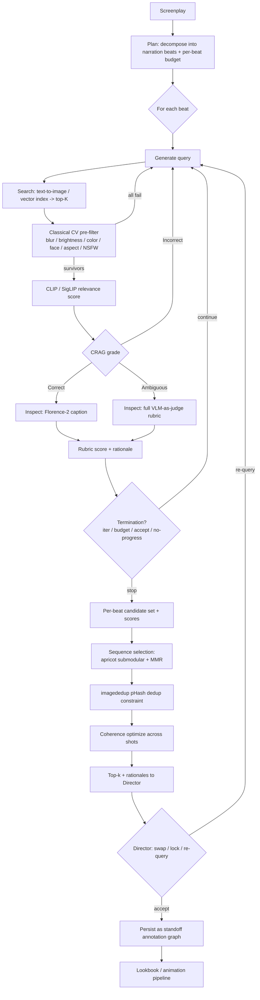

# Agentic Multimodal Retrieval for Screenplay-to-Animation Pipelines
### A Deep Technical Report on a VLM-in-the-Loop Retrieve / Rerank / Select Architecture for the reelee · lookbook Ecosystem
**Author: Thor Whalen** · June 17, 2026

> **How to save this file:** copy everything below into a file named `agentic-multimodal-retrieval.md`. It is authored as a standalone, downloadable Markdown document.

---

## TL;DR
- **Build a bounded corrective-RAG loop with a VLM judge gated behind cheap classical-CV pre-filters.** The architecture that wins for per-beat image selection is *CRAG-style* (retrieve → grade → conditionally re-query) [1] wrapped in a hard-bounded controller — **not** an open-ended ReAct agent. You get the self-correction benefit without the runaway cost that produced a documented four-agent LangChain loop running **264 hours (11 days) for $47,000** because the team had observability but no budget *enforcement* [2].
- **License discipline is the binding constraint, not capability.** The strongest open models carry traps: **pyiqa / IQA-PyTorch is non-commercial** (PolyForm NC + NTU S-Lab) [3], **NudeNet is AGPL-3.0** (network copyleft) [4], **LLaVA-1.5/1.6 inherit the Llama-2 Community License** [5], and **Qwen2.5-VL-3B and all 72B variants use a custom Qwen license** while 7B/32B are Apache-2.0 [6]. Prefer Florence-2 (MIT) [7], SigLIP (Apache-2.0) [8], CLIP (MIT) [9], apricot (MIT) [10], imagededup (Apache-2.0) [11].
- **Formalize selection as two stages:** per-beat relevance (CLIP/SigLIP score [12] + VLM-judge rubric) followed by a sequence-level submodular/MMR pass [10][13] for diversity, perceptual-hash near-duplicate suppression [14], and visual coherence — all persisted as **editable standoff annotations** [15] so a director can swap/lock without mutating the source.

---

## Key Findings

1. **The loop should be a state machine, not a free agent.** Map the six phases (generate query → search → inspect → critique → refine → select) onto CRAG's three-way grade — *Correct / Ambiguous / Incorrect* — produced by a lightweight retrieval evaluator (CRAG's is a 0.77B T5, far cheaper than Self-RAG's instruction-tuned 7B critic) [1][16]. Use ReAct framing [17] only for the *inspect/critique* micro-step; use plan-and-execute framing [18] for the *beat sequence* as a whole. This composition-over-inheritance split keeps expensive LLM reasoning at planning/grading nodes only.
2. **Gate the VLM behind classical CV.** Blur (Laplacian variance) [19], brightness/contrast, dominant color, face count, aspect ratio, and NSFW screening are sub-10ms/image checks that eliminate a large share of candidates before any token is spent. This is the single biggest cost lever.
3. **Two-tier inspect:** a cheap caption (Florence-2, MIT, ~1s on a T4 GPU) [7] suffices for most beats; escalate to a full VLM-as-judge (self-hosted Qwen2.5-VL-7B Apache-2.0 [6], or hosted GPT-4o/Claude) only when the grade is *Ambiguous* or when region grounding matters.
4. **VLM/LLM judges are biased and even adversarially foolable;** mitigate position bias (randomize/swap order) [20], verbosity bias (length-normalize) [21], and self-preference (judge with a different model family than any generator) [22]. Image judges specifically can be manipulated by brightness, overlays, and bounding-box highlights [23]. Prefer rubric-based pointwise scoring over free pairwise comparison.
5. **Sequence coherence is a first-class objective**, not an afterthought: formalize as submodular coverage [10] + a pairwise coherence bonus between consecutive shots, with perceptual-hash dedup [14] as a hard constraint.

---

## Details

### 1. THE AGENTIC LOOP DESIGN

**Architectural framings compared.**

| Framing | Control structure | Strength | Weakness | Role here |
|---|---|---|---|---|
| **ReAct** (Reason→Act→Observe) [17] | Tight per-step LLM loop | Adaptive to surprises; good for messy/uncertain steps | "Short-term thinking"; high LLM-call cost; no strategic foresight [18] | Only the **inspect/critique** micro-step on a single candidate |
| **Self-RAG** [16] | LLM emits reflection tokens deciding when to retrieve & whether output is supported | Self-correction baked into one model | Needs a model trained for reflection tokens; internal-consistency only | Inspiration for the **critique** node's "is this candidate supported by the beat?" check |
| **CRAG (Corrective RAG)** [1] | 0.77B retrieval evaluator → {Correct, Ambiguous, Incorrect} → corrective action (keep / refine+supplement / re-query) | Fixes *retrieval* quality; cheap evaluator; bounded branches | Doesn't reason across multiple beats | **Primary framing** for the per-beat loop |
| **Plan-and-Execute** [18] | Planner builds full plan upfront; executor runs steps, optionally re-plans | Fewer expensive LLM calls; predictable cost; sub-tasks can use smaller models | Rigid to mid-execution surprises | **Primary framing** for the **whole screenplay → sequence** orchestration |

Recommended composition: a **plan-and-execute** outer loop over beats (the planner decomposes the screenplay into narration beats and assigns each a budget), and a **CRAG** inner loop per beat (retrieve → grade → conditionally refine). ReAct/Self-RAG patterns appear only inside the inspect/critique node. CRAG's evaluator returns a confidence degree that triggers one of three knowledge actions [1] — the natural state-machine spine for the inner loop.

**The loop as a rule-table spec.**

```
STATE: {beat, query, candidates[], scored[], best, iter, spend, cache}
INIT:  query ← generate_query(beat); iter ← 0; spend ← 0

LOOP (per beat):
  R1  iter += 1
  R2  candidates ← search(query, k=K)                 # text-to-image / vector index
  R3  candidates ← prefilter(candidates)              # classical CV; drop fails
  R4  scored     ← clip_score(beat, candidates)       # cheap relevance (CLIP/SigLIP)
  R5  grade      ← evaluator(scored)                  # CRAG: Correct/Ambiguous/Incorrect
  R6  IF grade == Correct      → inspect top-m with caption;        goto SELECT
  R7  IF grade == Ambiguous    → inspect top-m with FULL VLM judge; goto SELECT
  R8  IF grade == Incorrect    → query ← refine_query(beat, critique); goto TERMINATION
  SELECT: best ← argmax(rubric_score); record rationale

TERMINATION (evaluated BEFORE next search):
  T1  iter ≥ MAX_ITER             → stop, return best-so-far   (hard cap)
  T2  spend ≥ BUDGET_CAP          → stop, return best-so-far   (hard $/token ceiling)
  T3  best.rubric ≥ ACCEPT_THRESH → stop, success
  T4  no_progress(scored, prev)   → stop (state unchanged across iters)
  T5  else                        → continue loop
```

**Termination criteria & cost controls.** Production agent loops layer multiple stop conditions: a maximum-iteration cap, a hard token/cost budget evaluated *before each call completes*, no-progress detection, and a goal-achievement (accept-threshold) check [24][25]. These must be enforced in controller code, not prompts. The canonical failure mode is the **November 2025 incident in which four LangChain agents coordinating via the A2A protocol — an Analyzer and a Verifier "ping-ponging requests" — ran for 264 hours and cost $47,000; the post-mortem found two root causes: no per-agent budget caps and no mechanism to terminate the session before the next API call completed** [2]. Cost levers, in order of impact: (1) classical-CV pre-filter before any VLM call; (2) caption-first, escalate-to-VLM-only-on-ambiguity; (3) cache candidate inspections keyed by `(image_hash, beat_id)`; (4) route routine steps to smaller models, reserve the large model for grading/refinement [18]; (5) early-stop on accept-threshold.

### 2. IMAGE-TO-TEXT FOR THE INSPECT STEP

Decision rule: **a caption suffices** when the beat needs only coarse subject/scene matching; **a full VLM judgment** is needed when you must (a) reason about the beat's mood/intent, (b) localize/ground regions ("is the protagonist on the left?"), (c) compare multiple candidates, or (d) produce a rationale for the director.

| Model | Type | Grounding / region | Latency (approx) | Cost | License | When to use |
|---|---|---|---|---|---|---|
| **Florence-2** (base ~230M, large ~770M) [7][26] | Unified VLM: caption / OD / phrase grounding / OCR / segmentation | **Yes** — phrase grounding, dense region caption, OCR-with-region | ~1s/image OCR on a T4 GPU [27] | Self-host; tiny (1.54 GB weights) | **MIT** ✅ [7] | Default caption + light grounding; runs on edge/T4 |
| **BLIP-2** (opt-2.7b, flan-t5-xl/xxl) [28] | Caption / VQA (Q-Former + frozen LLM) | Weak | Moderate, self-host | Self-host | **MIT** repo ✅; OPT variants embed Meta OPT weights (non-commercial-leaning) ⚠️; Flan-T5 variants embed Apache-2.0 Flan-T5 [28] | Classic lightweight captioner; prefer Flan-T5 variant for license safety |
| **LLaVA-1.5 / 1.6** (7B/13B) [5] | Full VLM chat | Moderate | Self-host, GPU-heavy | Self-host | 🚩 **Llama-2 Community License** (Vicuna/Llama-based); **Mistral-7B & 34B (Yi) variants** are Apache-2.0 / better terms [5] | Use only the Mistral/Yi variants commercially |
| **Qwen2-VL / Qwen2.5-VL** (3B/7B/32B/72B) [6][29] | Full VLM, dynamic resolution, strong JSON output, multi-image compare | **Yes** — strong grounding, multi-image compare | 7B runs on a 24 GB GPU [29] | Self-host | **Apache-2.0** for 2B/7B/32B ✅; 🚩 **custom Qwen license** for 2.5-VL-3B and all 72B [6] | **Best self-hosted judge: Qwen2.5-VL-7B (Apache-2.0)** |
| **GPT-4o** (hosted) [30] | Frontier VLM | High quality | API latency | **$2.50 / 1M input, $10.00 / 1M output**; image billed tile-based (85 base + 170×tiles, high detail) [30][31] | Proprietary API | Hosted judge for hardest/ambiguous beats (note GPT-4.1 dropped image input; verify current lineup) [32] |
| **Claude (Sonnet, vision)** [33] | Frontier VLM | High quality | API latency | Sonnet-class ≈ $3 / 1M in, $15 / 1M out; image ≈ (w×h)/750 tokens [31][33] | Proprietary API | Hosted judge; strong long-form rationale; use a *different* family than your generator to cut self-preference bias [22] |

**Recommendation.** Default inspect = **Florence-2 (MIT)** caption + grounding. Escalation judge = **Qwen2.5-VL-7B (Apache-2.0)** self-hosted, or a hosted frontier model (GPT-4o / Claude vision) when quality dominates cost. Avoid Llama-2-licensed LLaVA and the custom-licensed Qwen sizes for commercial production.

### 3. CLASSICAL CV PRE-FILTERS (run BEFORE any VLM call)

| Check | Method | Library | License | Notes |
|---|---|---|---|---|
| **Blur / sharpness** | Variance of Laplacian; below threshold ⇒ blurry [19] | **OpenCV** `cv2.Laplacian(img,CV_64F).var()` | **Apache-2.0** (OpenCV ≥4.5; ≤4.4 BSD-3) ✅ — ⚠️ wheels bundle LGPL FFmpeg/Qt binaries [34] | One-line; threshold is application-specific |
| **Brightness / contrast** | Mean & std of luminance / grayscale | **Pillow** (`ImageStat`), **OpenCV**, **scikit-image** | Pillow **MIT-CMU** ✅ [35]; scikit-image **BSD-3-Clause** ✅ [36] | Cheap reject of under/over-exposed frames |
| **Dominant color / palette** | Median-cut / clustering | **colorthief** (BSD-3 ✅) [37], **colorgram.py** (MIT ✅) [38], **fast-colorthief** (C++ backend) [39] | see cells | colorgram is faster & "more intense"; feed palette-coherence features downstream |
| **Face count / size** | Detector backends | **MediaPipe** (Apache-2.0 ✅, fastest) [40], **deepface** wrapper (MIT lib ✅ — wrapped models inherit own licenses ⚠️) [41], RetinaFace/MTCNN (accuracy), OpenCV Haar (Apache-2.0) | see cells | MediaPipe BlazeFace for speed; RetinaFace for accuracy [42] |
| **Aspect ratio / composition** | Pixel-dim ratios; rule-of-thirds, saliency centroid | **Pillow** / **OpenCV** / **scikit-image** | MIT-CMU / Apache-2.0 / BSD-3 ✅ | Pure arithmetic; enforce shot framing |
| **NSFW / safety** | Binary or region classifier | 🚩 **NudeNet** (AGPL-3.0 — network copyleft!) [4], **opennsfw2** (MIT ✅) [43], **Falconsai/nsfw_image_detection** (Apache-2.0 ✅, ViT) [44] | see cells | **Prefer opennsfw2 or Falconsai** for license safety; avoid AGPL NudeNet unless you accept copyleft or buy a commercial license |

These run in milliseconds on CPU and are the primary cost gate. Order them cheapest-first (arithmetic brightness/aspect → blur → color → face → NSFW model) and short-circuit on the first hard failure.

### 4. RELEVANCE SCORING & RERANKING

**Embedding-based score (cheap first pass).**
- **CLIP score**: cosine similarity between the text-beat embedding and the image embedding (softmax contrastive) [12]. Library: **open_clip** (MIT lib ✅; per-checkpoint weights vary — OpenAI/LAION weights MIT, some third-party CC-BY-NC ⚠️) [45]. Original CLIP weights **MIT** [9].
- **SigLIP / SigLIP2**: sigmoid pairwise loss, scores image–text pairs independently; strong zero-shot retrieval, memory-efficient at large batch [46]. License **Apache-2.0** ✅ [8]. Note a documented CLIP↔SigLIP gap: CLIP-style softmax enforces batch-relative ranking (better at relative conflict resolution / object-flip), SigLIP scores pairs absolutely [47].
- Optional rerank head: **ELIP** (query-conditioned visual prompts) boosts CLIP/SigLIP/BLIP-2 retrieval by reranking the top-k [48].

**VLM-as-judge (expensive second pass).** Use a rubric (pointwise) rather than free pairwise. Rubric dimensions for a narration beat: subject match, action/pose match, setting match, mood/lighting match, style consistency, technical quality. Emit structured JSON scores + a one-line rationale per dimension.

**Bias / failure taxonomy of VLM/LLM judges** (with mitigations and typical magnitudes):

| Bias | Definition | Typical magnitude | Mitigation |
|---|---|---|---|
| **Position bias** | Prefers a response by ordinal position regardless of quality; order alone can flip outcomes [20] | ~5–15% (≈10% first-position for GPT-4 pairwise) [49] | Randomize order; swap & average both orderings; measure swap-consistency |
| **Verbosity / length bias** | Prefers longer outputs [21] | ~10–20% [49] | Length-normalize; post-hoc regression adjustment |
| **Self-preference / self-enhancement** | Scores own / same-family outputs higher (linked to lower perplexity = more "familiar") [22] | ~10–25% [49] | Use a judge from a **different provider/family** than the generator |
| **Style / formatting bias** | Prefers markdown/confident tone [21] | Variable | Rubric-based scoring; blind to formatting |
| **Sycophancy / instruction leakage** | Agrees with perceived consensus; rewards rubric-hacking | Variable | Reference-guided grading; keep judge blind to criteria provenance |
| **Visual manipulation (image judges)** | Brightness, overlays, beauty filters, bounding-box highlights inflate scores [23] | Attack success ~70–90% with score inflation up to 80% [23] | Normalize exposure; strip overlays; adversarial spot-checks |

Caveat from 2026 research: the ~80% human-agreement figure comes from benign MT-Bench-style evaluations (GPT-4 agreed with human evaluators >80% of the time across ~3,000 expert votes) [50]; under adversarial stress-testing frontier judges exceeded 50% error rates [51]. **Calibrate any judge against human spot-checks for your domain.**

### 5. SELECTION ACROSS A SEQUENCE

Goal: choose one image per beat maximizing (a) per-beat relevance, (b) cross-shot visual coherence, (c) diversity / no near-duplicates.

**Formalization.** Let beats b₁…bₙ each have candidate set Cᵢ with relevance `rel(c)`. Select s = (s₁…sₙ), sᵢ∈Cᵢ to maximize:

```
J(s) = Σ_i rel(s_i)                          # relevance
     + α Σ_i coherence(s_i, s_{i-1})          # consecutive-shot visual coherence
     − β Σ_i redundancy(s_i, {s_j: j<i})      # diversity / anti-duplication
subject to:  phash_distance(s_i, s_j) ≥ τ     # hard near-duplicate constraint
```

**Tools.**

| Technique | What it does | Library | License |
|---|---|---|---|
| **MMR (Maximal Marginal Relevance)** [13] | Greedy: `λ·rel − (1−λ)·max-sim-to-selected`; post-scoring reranker, no retraining | LangChain `maximal_marginal_relevance`, or ~15 lines NumPy | OSS (MIT-class) ✅ |
| **Submodular selection** [10] | Facility-location / feature-based coverage with lazy-greedy + numba; diminishing returns ⇒ minimally redundant representative set | **apricot** (jmschrei) | **MIT** ✅ [10] |
| **Perceptual-hash dedup** [14] | pHash/dHash/aHash/wHash + CNN; Hamming-distance threshold to find/remove near-dups | **imagededup** (idealo) | **Apache-2.0** ✅ [11] |
| **No-reference IQA / aesthetics** [52] | Score candidate quality/aesthetics without a reference (NIQE, BRISQUE, MUSIQ, CLIP-IQA, NIMA, TOPIQ) | 🚩 **pyiqa / IQA-PyTorch** [52] | 🚩 **PolyForm Noncommercial 1.0.0 + NTU S-Lab — NON-COMMERCIAL** [3] |

**Coverage/diversity objective.** Use apricot's facility-location to pick a representative, low-redundancy short-list per beat [10]; then MMR (or the sequence objective above) to choose the final frame balancing relevance vs. redundancy against already-locked neighbors [13]. `coherence(sᵢ, sᵢ₋₁)` can be operationalized as similarity in palette (colorgram features), CLIP-embedding cosine within a target band (similar but not identical), and matching aspect/exposure.

**License warning on pyiqa.** Because IQA-PyTorch is **non-commercial** [3], do not ship it in a commercial reelee build. Alternatives: implement NIQE/BRISQUE directly via scikit-image/OpenCV primitives, train an in-house NIMA-style scorer on a permissive backbone, or use aesthetic-predictor weights only where their individual licenses permit.

### 6. HUMAN-IN-THE-LOOP AFFORDANCES

Present top-k candidates per beat with per-dimension rubric scores and the VLM's one-line rationale. The director can **swap** (pick a different candidate), **lock** (freeze a choice so the sequence optimizer treats it as a fixed neighbor), and **re-query** (edit the beat's query and re-run the inner loop).

**Persistence as standoff annotation.** Do **not** mutate the screenplay or candidate store. Represent every decision as a **standoff annotation** — annotations stored separately from the source, pointing into it by reference — following the **STAM (Stand-off Text Annotation Model)** premise that any information about a text is itself an annotation, and annotations may point to other annotations (higher-order) [15]. This yields an **annotation graph**: beat-node → selection-annotation → candidate-node, with director overrides as new annotations layered atop machine choices (never destructive edits). STAM treats annotations as effectively immutable — you delete-and-recreate rather than edit in place [15], and standoff has the well-known property that the original document is never marked up by processing steps [53]. **Note STAM's reference Rust/Python implementation is GPL-3.0** [15], so for a commercial build adopt the *model/pattern* (standoff + annotation graph) with your own permissively-licensed implementation rather than linking the GPL library.

**Schema (per stage).**

```
QUERY      {beat_id, text, style_tags[], neg_tags[], budget}
SEARCH     {query_id, candidate_ids[], scores[], k}
PREFILTER  {candidate_id, blur, brightness, contrast, palette[], face_count, aspect, nsfw_prob, pass:bool, reasons[]}
INSPECT    {candidate_id, caption, regions[], ocr?, mode: caption|vlm}
SCORE      {candidate_id, clip|siglip: float, rubric:{subject,action,setting,mood,style,quality}, rationale}
SELECT     {beat_id, chosen_id, topk_ids[], J_components:{rel,coherence,redundancy}, locked:bool}
ANNOTATION {ann_id, target: beat_id|candidate_id, type: machine|director, points_to[], created, editable:true}
```

**Failure-mode enumeration with field mappings.**

| Failure mode | Detected at stage | Field signal | Corrective action |
|---|---|---|---|
| Empty / again retrieval | SEARCH | `candidate_ids == []` | refine_query; broaden k; fall back to web/asset search |
| All candidates low-quality | PREFILTER | all `pass == false` | relax thresholds OR re-query with style change |
| Blurry winner | PREFILTER | `blur < τ_blur` | drop; escalate to next candidate |
| Off-mood / wrong setting | SCORE | `rubric.mood/setting low` | CRAG grade = Incorrect → refine_query |
| Judge disagreement / low confidence | SCORE | rubric variance high; grade = Ambiguous | escalate caption→full VLM; swap-order to test position bias |
| Near-duplicate across beats | SELECT | `phash_distance < τ` | enforce constraint; pick next-best diverse candidate |
| Incoherent shot transition | SELECT | `coherence(s_i,s_{i-1}) < τ_c` | re-rank with higher α; consider locking neighbor first |
| Budget exceeded | TERMINATION | `spend ≥ BUDGET_CAP` | hard stop; return best-so-far; flag for human |
| Loop non-progress | TERMINATION | `scored == prev_scored` | stop; surface to director |
| NSFW / safety hit | PREFILTER | `nsfw_prob > τ` | hard drop; never forward to VLM |

### Mermaid diagram of the overall pipeline



---

## Recommendations

**Stage 0 — License-safe baseline (ship first).** Classical-CV pre-filter (OpenCV Apache-2.0, Pillow MIT-CMU, scikit-image BSD-3, colorthief BSD-3, MediaPipe Apache-2.0, opennsfw2 MIT) + SigLIP/CLIP relevance (Apache-2.0 / MIT) + Florence-2 captions (MIT) + apricot (MIT) + imagededup (Apache-2.0). No non-permissive dependency anywhere. This alone delivers retrieve → prefilter → score → dedupe → select.

**Stage 1 — Add the corrective loop.** Wrap per-beat retrieval in the CRAG rule-table with hard `MAX_ITER`, `BUDGET_CAP`, `ACCEPT_THRESH`, and no-progress stops enforced in controller code [24][25]. Add inspection caching keyed by `(image_hash, beat_id)`.

**Stage 2 — Add the escalation judge.** Introduce Qwen2.5-VL-7B (Apache-2.0) self-hosted as the Ambiguous-grade judge; optionally allow a hosted frontier model (GPT-4o / Claude vision) per-beat when a "high-stakes" flag is set. Apply judge-bias mitigations (order-swap, length-norm, cross-family) [20][21][22] and exposure/overlay normalization against image-judge attacks [23].

**Stage 3 — Sequence coherence + HITL.** Turn on the full sequence objective `J(s)` with the coherence term and pHash hard constraint; ship the director swap/lock/re-query UI persisting standoff annotations [15].

**Benchmarks / thresholds that change the plan:**
- If per-beat VLM spend > target $/beat → raise pre-filter aggressiveness or lower escalation rate (caption-only for more grades).
- If director override rate > ~30% → the rubric or query-generation is miscalibrated; collect overrides as labels and tune.
- If near-duplicate complaints persist → lower pHash τ and raise MMR's diversity weight `(1−λ)`.
- If you ever need pyiqa-grade aesthetics commercially → replace with an in-house NIMA-style scorer (permissive backbone); do **not** ship PolyForm-NC code.
- If NSFW recall is insufficient with opennsfw2 → evaluate Falconsai ViT (Apache-2.0) as a second gate before considering AGPL NudeNet (which would impose network-copyleft on the whole service).

---

## Caveats
- **Pricing and model availability move fast.** GPT-4o was **$2.50 / $10 per 1M tokens (in/out)** as of 2026 reporting [30]; Claude Sonnet-class ≈ $3/$15 [33]; image-token formulas (OpenAI tile-based 85 + 170×tiles; Anthropic ≈ pixels/750; Gemini ≈ fixed 258/image) are vendor-documented approximations [31] — verify against official billing before committing. OpenAI's 2026 lineup has moved toward GPT-5.x; confirm a vision-capable model is current [32].
- **License conflicts exist in the wild.** NudeNet's GitHub is **AGPL-3.0** while its PyPI metadata lists MIT — treat as AGPL-3.0 absent written permission [4]. Library-code licenses (deepface MIT [41], open_clip MIT [45]) do **not** cover the wrapped model weights, which carry their own (sometimes CC-BY-NC) terms. Always re-verify the specific checkpoint.
- **VLM-judge reliability is domain-specific.** The ~80% human-agreement figure is from benign benchmarks [50]; adversarial bias tests show >50% error [51] and image-specific manipulations achieve 70–90% attack success [23]. Calibrate on your own beats and keep a human in the loop for final sign-off.
- **CLIP/SigLIP behavioral gap** means the "best" relevance encoder depends on whether your beats stress relative ranking (CLIP) or absolute pair scoring (SigLIP) [47]; A/B test both.
- The **reelee research-notes** document in Drive only points to an external Dropbox folder of research reports; this report is built from public technical sources plus that ecosystem framing, not from internal design specs I could read directly.

---

## References

1. [Yan et al., *Corrective Retrieval Augmented Generation* (CRAG), arXiv:2401.15884](https://arxiv.org/abs/2401.15884)
2. [The $47,000 Agent Loop: Why Token Budget Alerts Aren't Budget Enforcement — Waxell](https://waxell.ai/blog/ai-agent-token-budget-enforcement)
3. [IQA-PyTorch (pyiqa) — GitHub README / license (PolyForm Noncommercial + NTU S-Lab)](https://github.com/chaofengc/IQA-PyTorch)
4. [NudeNet — notAI-tech GitHub (AGPL-3.0)](https://github.com/notAI-tech/NudeNet)
5. [LLaVA-v1.5-7b model card (Llama-2 Community License) — Hugging Face](https://huggingface.co/liuhaotian/llava-v1.5-7b)
6. [Qwen2.5-VL-7B-Instruct (Apache-2.0) — Hugging Face](https://huggingface.co/Qwen/Qwen2.5-VL-7B-Instruct); [Qwen2.5-VL-3B LICENSE (custom Qwen)](https://huggingface.co/Qwen/Qwen2.5-VL-3B-Instruct/blob/main/LICENSE)
7. [Florence-2-large LICENSE (MIT) — Hugging Face](https://huggingface.co/microsoft/Florence-2-large/blob/main/LICENSE)
8. [SigLIP2-base (Apache-2.0) — Hugging Face](https://huggingface.co/google/siglip2-base-patch16-224)
9. [OpenAI CLIP LICENSE (MIT) — GitHub](https://github.com/openai/CLIP/blob/main/LICENSE)
10. [apricot: Submodular selection in Python (MIT) — GitHub](https://github.com/jmschrei/apricot); [JMLR paper](https://www.jmlr.org/papers/v21/19-467.html)
11. [imagededup — idealo GitHub (Apache-2.0)](https://github.com/idealo/imagededup)
12. [Boosting Image Search Using SigLIP 2 / CLIP scoring — Analytics Vidhya](https://www.analyticsvidhya.com/blog/2025/02/boosting-image-search-capabilities-using-siglip-2/)
13. [Maximal Marginal Relevance (MMR) explainer — Aayush Agrawal](https://aayushmnit.com/posts/2025-12-25-DiversityMMRPart1/DiversityMMRPart1.html)
14. [imagededup — Hashing methods documentation](https://idealo.github.io/imagededup/methods/hashing/)
15. [STAM: Stand-off Text Annotation Model — annotation/stam GitHub (GPL-3.0)](https://github.com/annotation/stam)
16. [Self-Reflective RAG with LangGraph (Self-RAG & CRAG) — LangChain](https://www.langchain.com/blog/agentic-rag-with-langgraph)
17. [Agent Architectures: ReAct, Self-Ask, Plan-and-Execute — APXML](https://apxml.com/courses/langchain-production-llm/chapter-2-sophisticated-agents-tools/agent-architectures)
18. [Plan-and-Execute Agents — LangChain](https://www.langchain.com/blog/planning-agents)
19. [Blur detection with OpenCV (variance of Laplacian) — PyImageSearch](https://pyimagesearch.com/2015/09/07/blur-detection-with-opencv/)
20. [Wang et al., *Large Language Models are not Fair Evaluators*, arXiv:2305.17926](https://arxiv.org/abs/2305.17926)
21. [Position Bias in LLM Judges: Measurement and Mitigation — Michael Brenndoerfer](https://mbrenndoerfer.com/writing/position-bias-in-llm-judges)
22. [Self-Preference Bias in LLM-as-a-Judge, arXiv:2410.21819](https://arxiv.org/abs/2410.21819)
23. [Hwang et al., *FRAME: Fooling Multimodal LLM Judges*, arXiv (May 2025)](https://arxiv.org/abs/2505.15243)
24. [How to Build an Agentic Loop with Claude Code: Verification, Cost, and Stopping Criteria — MindStudio](https://www.mindstudio.ai/blog/how-to-build-agentic-loop-claude-code)
25. [What Is the AI Agent Loop? — Oracle Developers](https://blogs.oracle.com/developers/what-is-the-ai-agent-loop-the-core-architecture-behind-autonomous-ai-systems)
26. [Florence-2: Vision-language Model — Roboflow](https://blog.roboflow.com/florence-2/)
27. [How to Use Florence-2 for Optical Character Recognition — Roboflow](https://blog.roboflow.com/florence-2-ocr/)
28. [Salesforce BLIP-2 (blip2-opt-2.7b, MIT) — Hugging Face](https://huggingface.co/Salesforce/blip2-opt-2.7b)
29. [Qwen2.5-VL Vision Language Model guide — Clore.ai](https://docs.clore.ai/guides/vision-models/qwen-vl)
30. [GPT-4o Pricing 2026 — PE Collective](https://pecollective.com/tools/gpt-4o-pricing/)
31. [AI Image Token Calculator (GPT-4o / Claude / Gemini image-token formulas) — Stellaxon](https://stellaxon.com/ai/image-token-calculator)
32. [OpenAI API Pricing](https://openai.com/api/pricing/)
33. [LLM API Pricing Comparison (OpenAI, Gemini, Claude) — IntuitionLabs](https://intuitionlabs.ai/articles/llm-api-pricing-comparison-2025)
34. [opencv-python — PyPI (Apache-2.0; LGPL-bundled wheels)](https://pypi.org/project/opencv-python/)
35. [Pillow LICENSE (MIT-CMU) — GitHub](https://github.com/python-pillow/Pillow/blob/main/LICENSE)
36. [scikit-image license (BSD-3-Clause)](https://scikit-image.org/docs/dev/license.html)
37. [color-thief-py — fengsp GitHub (BSD-3-Clause)](https://github.com/fengsp/color-thief-py)
38. [colorgram.py — obskyr GitHub / PyPI (MIT)](https://github.com/obskyr/colorgram.py)
39. [fast-colorthief — GitHub](https://github.com/bedapisl/fast-colorthief)
40. [MediaPipe — google-ai-edge GitHub (Apache-2.0)](https://github.com/google-ai-edge/mediapipe/blob/master/LICENSE)
41. [deepface — serengil GitHub (MIT library; wrapped models inherit own licenses)](https://github.com/serengil/deepface)
42. [What is Face Detection? Ultimate Guide + Model Comparison — LearnOpenCV](https://learnopencv.com/what-is-face-detection-the-ultimate-guide/)
43. [opennsfw2 — bhky GitHub (MIT)](https://github.com/bhky/opennsfw2)
44. [Falconsai/nsfw_image_detection (Apache-2.0) — Hugging Face](https://huggingface.co/Falconsai/nsfw_image_detection)
45. [open_clip — mlfoundations GitHub (MIT library; per-checkpoint weight licenses vary)](https://github.com/mlfoundations/open_clip)
46. [CLIP to SigLIP: Vision-Language Models with Contrastive Learning — Ritwik Raha](https://blog.ritwikraha.dev/choosing-between-siglip-and-clip-for-language-image-pretraining)
47. [Language-Guided Invariance Probing of Vision-Language Models (CLIP↔SigLIP gap), arXiv:2511.13494](https://arxiv.org/pdf/2511.13494)
48. [ELIP: Enhanced Visual-Language Foundation Models for Image Retrieval, arXiv:2502.15682](https://arxiv.org/html/2502.15682v3)
49. [When "Better" Prompts Hurt: Evaluation-Driven Iteration (bias magnitudes table), arXiv:2601.22025](https://arxiv.org/pdf/2601.22025)
50. [Zheng et al., *Judging LLM-as-a-Judge with MT-Bench and Chatbot Arena* — referenced via Adaline](https://www.adaline.ai/blog/llm-as-a-judge-reliability-bias)
51. [LLM-as-a-Judge: Why Frontier Models Fail 50%+ Bias Tests — Adaline](https://www.adaline.ai/blog/llm-as-a-judge-reliability-bias)
52. [pyiqa / IQA-PyTorch — PyPI](https://pypi.org/project/pyiqa/)
53. [Tools to Address the Interdependence between Tokenisation and Standoff — University of Edinburgh](https://www.inf.ed.ac.uk/publications/online/0802.pdf)